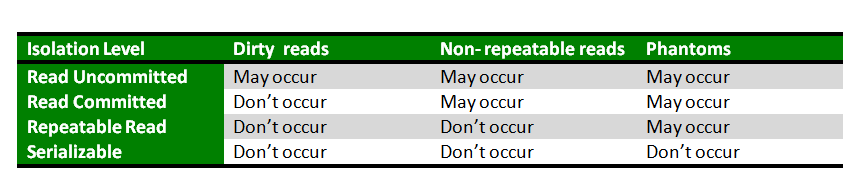

# Transaction Isolation Levels in DBMS

It follows the ACID properties. Among fours properties (Atomicity, Consistency, Isolation, Durability) Isolation determines how transactions integrity is visible to other users and systems.

Isolation levels define the degree to which a transaction must be isolated from the data modifications made by any other transaction in the database system. A transaction isolation level is defined by the following phenomena:

- **Dirty Read**: A Dirty read is a situation when a transaction reads data that has not yet been commited. For example, Let's say transaction 1 updates a row and leaves it uncommited, meanwhile, transaction 2 reads the updated row. If transaction 1 rolls back the change, transaction 2 will have read data that is considered nerver to have existed.
- **Non Repeatable read**: Non Repeatable read occurs when a transaction reads the same row twice and gets a different value each time. For example, suppose trasaction 1 reads data. Due to concurrency, another transaction 2 updates the same data and commit, Now if transaction 1 rereads the same data, it will retrieve a different value.
- **Phantom read**: Phantom Read occurs when two same queries are executed, but the rows retrieved by the two, are different. For example, suppose transaction 1 retrieves a set of rows that satisfy some search criteria. Now transaction 2 ganerates some new rows that match the search criteria for transaction 1. If transaction 1 re-executes the statement that reads the rows, it gets a different set of rows this time.

Based on these phenomena, The SQL standard defines four isolation levels:

1. **Read Uncommitted**: Read Uncommitted is the lowest isolation level. In this level, one transaction may read not yet committed changes made by other transactions, thereby allowing dirty reads. At this level, transactions are not isolated from each other.
2. **Read Committed**: This isolation level guarantees that any data read is committed at the moment it is read. This it doesnt allow dirty read. The transaction holds a read or write lock on the current row, and thus prevents other transactions from reading, updating, or deleting it.
3. **Repeatable Read**: This is the most restrictive isolation level, The transaction holds read locks on all rows it references and writes locks on referenced rows for update and delete actions. Since other transactions cannot read, update or delete these rows, consequently it avoids non repeatable read.
4. **Serializable**: This is the highest isolation level. A serializable execution is guaranteed to be serializable. Serializable execution is defined to be an execution of operations in which concurrently executin transactions appears to be serially executing.

